# TruckRoute Planner — Enterprise Commercial Fleet & HOS Compliance Platform

> **Portfolio Showcase & Technical Architecture Specification**  
> A full-stack, enterprise-grade GIS route optimization and Electronic Logging Device (ELD) compliance platform built for commercial truck dispatchers and long-haul drivers under US FMCSA regulations.

---

## 📸 Portfolio Visual Showcase

| Application View | Feature Description |
| :--- | :--- |
| 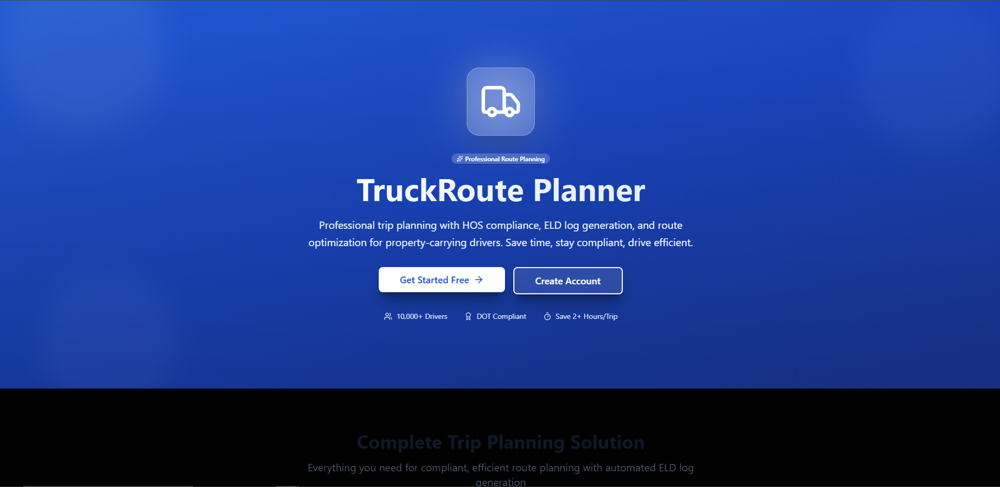 | **Public Landing Page**: Modern, high-converting showcase highlighting route optimization and ELD features. |
| 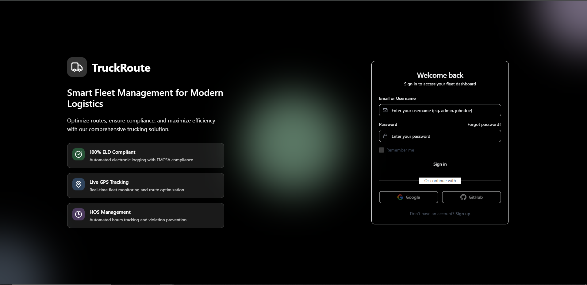 | **Authentication Portal**: Role-based JWT access for Drivers, Dispatchers, and Fleet Managers. |
| 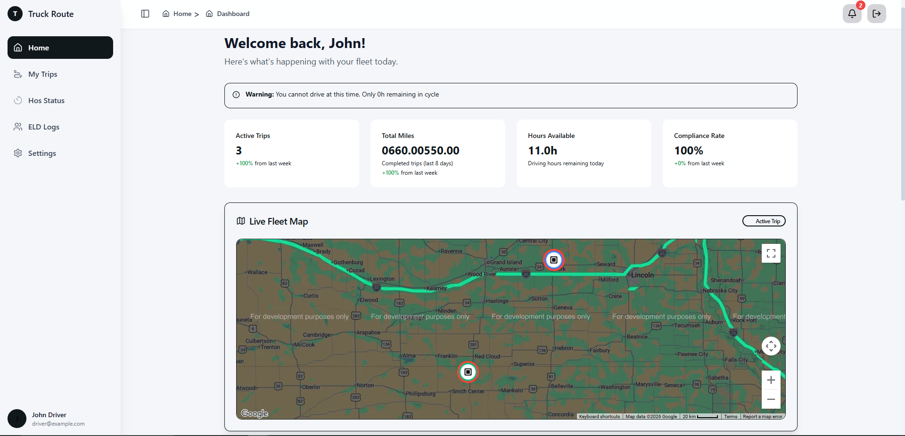 | **Driver Live Dashboard**: Real-time HOS duty clocks, remaining driving window, active trip map, and metrics. |
| 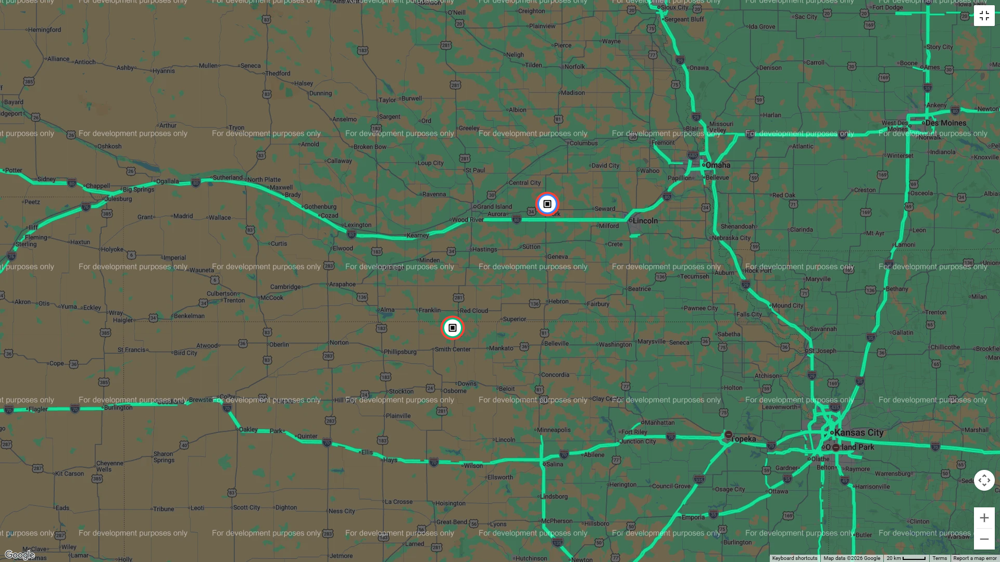 | **Active Trip View**: Interactive multi-stop routing with automated fuel stop recommendations and waypoint sequencing. |
| 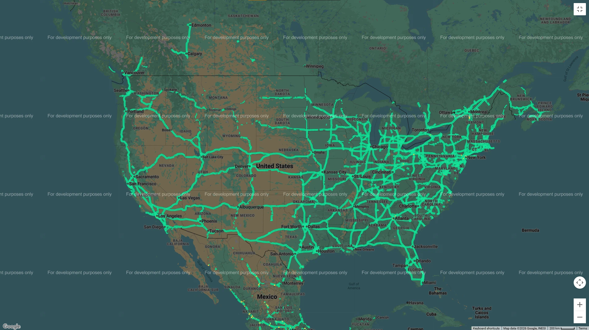 | **Live Fleet Map**: PostGIS-powered spatial mapping with real-time driver tracking and waypoint overlays. |
| 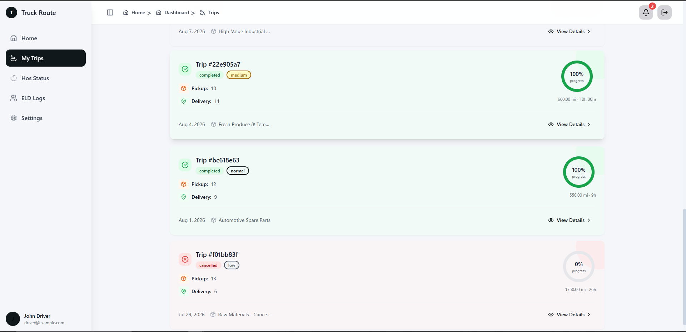 | **Driver Trips Portal**: Complete trip history with filtering by status (*Planned, In Progress, Completed, Cancelled*). |
| 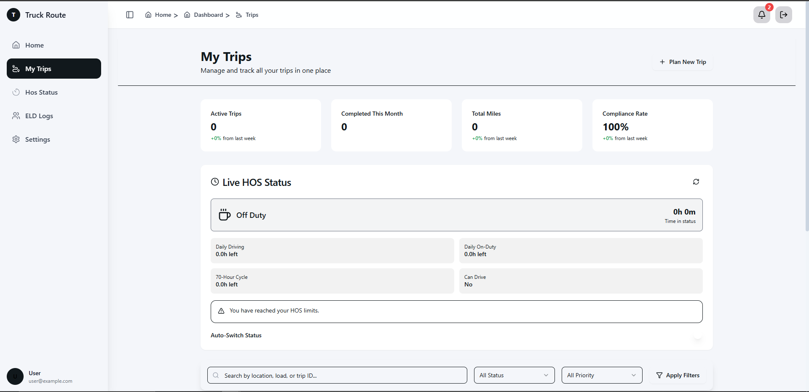 | **Fleet Trips Directory**: Dispatcher-level overview for managing active loads and assigning driver routes. |
| 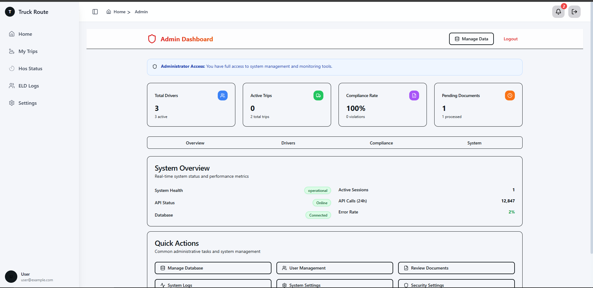 | **Admin Control Panel**: Fleet analytics, compliance summaries, CRUD management, and user management. |
| 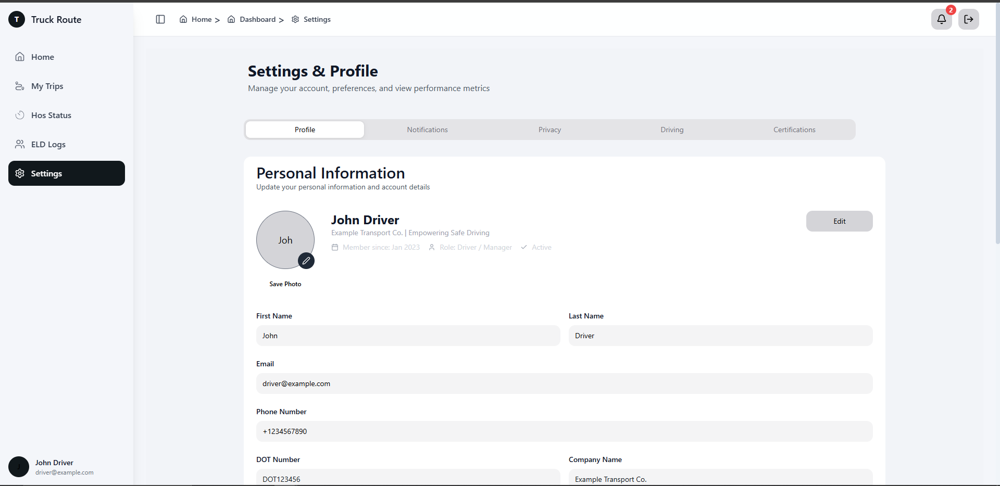 | **Driver Preferences & Settings**: Customizable truck parameters (fuel capacity, toll avoidance, max driving hours). |

---

## 🛠️ Technology Stack & System Architecture

### **Backend Framework & Spatial GIS**
- **Core Engine**: Python 3.11, Django 4.2 LTS, Django REST Framework (DRF)
- **Geospatial Processing**: GeoDjango (`django.contrib.gis`), PostGIS (PostgreSQL 15 + Spatial Extensions 3.3), `GDAL`, `GEOS`, `PROJ`
- **Asynchronous & Scheduled Tasks**: Celery 5.x, Celery Beat (Periodic HOS auto-switches, cycle resets)
- **Caching & Message Broker**: Redis 7 (In-memory caching for live duty status, task queue)
- **WSGI Application Server**: Gunicorn 21.x with multi-worker sync workers

### **Frontend & UI Architecture**
- **Core Framework**: React 19, TypeScript 5.8, Vite 7
- **Styling & Components**: TailwindCSS 3.4, HeroUI (`@heroui/react`), Radix UI Primitives, Lucide Icons
- **State Management & Data Fetching**: Zustand (Authentication & Global UI state), `@tanstack/react-query` v5 (Caching & Server synchronization)
- **Map & Spatial Rendering**: Mapbox GL JS / React Map GL, Google Maps JavaScript API
- **Form Validation**: `react-hook-form` integrated with `zod` schema resolvers

### **DevOps, Containerization & Infrastructure**
- **Container Deployment**: Docker Multi-stage builds (`Dockerfile`, `Dockerfile.prestart`)
- **Orchestration**: Docker Compose with health check dependencies (`postgres`, `redis`, `prestart`, `backend`, `celery_worker`, `celery_beat`)
- **Reverse Proxy**: Nginx (Production static asset serving & SSL termination)
- **Database Migrations**: Automated Django migration prestart verification script (`prestart.py`)

---

## 🧠 Core System Capabilities & Domain Mechanics

### 1. **FMCSA Hours of Service (HOS) Compliance Engine**
The platform enforces strict Federal Motor Carrier Safety Administration (FMCSA) property-carrying driver rules:
- **11-Hour Driving Limit**: A driver may drive a maximum of 11 hours after 10 consecutive hours off duty.
- **14-Hour Duty Window**: A driver cannot drive beyond the 14th consecutive hour after coming on duty.
- **30-Minute Break Requirement**: Driving is prohibited if more than 8 hours have elapsed since the end of the driver's last off-duty or sleeper berth period of at least 30 minutes.
- **70-Hour / 8-Day & 60-Hour / 7-Day Cycle Limits**: Tracks total on-duty hours accumulative across rolling 7 or 8-day periods.
- **34-Hour Restart Engine**: Automatically detects and applies 34-hour off-duty restarts to reset cycle hours.

```
       +-----------------------------------------------------------+
       |                  HOS Duty State Machine                   |
       +-----------------------------------------------------------+
                                   |
            +----------------------+----------------------+
            |                      |                      |
    +-------v-------+      +-------v-------+      +-------v-------+
    |   OFF_DUTY    |      | SLEEPER_BERTH |      |    DRIVING    |
    +-------+-------+      +-------+-------+      +-------+-------+
            |                      |                      |
            +----------------------+----------------------+
                                   |
                           +-------v-------+
                           |    ON_DUTY    |
                           +---------------+
```

### 2. **Geospatial Route Planning & Waypoint Sequencing**
- **PostGIS Spatial Queries**: Computes distances, coordinates (`PointField` in SRID 4326), and spatial intersections.
- **Intelligent Fuel Stop Generator**: Recommends optimal fuel stops along active routes based on truck fuel tank capacity, fuel prices, and driver brand preferences (*Love's, Pilot, TA*).
- **Interactive Multi-Stop Routing**: Supports multi-waypoint routes (Pickups, Deliveries, Fuel Stops, Rest Breaks, Inspection Points).

### 3. **Automated Electronic Logging Device (ELD) Engine**
- **24-Hour Grid Generation**: Generates 1440-minute daily ELD log entries automatically based on duty status transitions.
- **Odometer & Engine Hour Verification**: Validates starting/ending odometer readings against trip distances.
- **Digital Driver Certification**: Provides cryptographic checksum validation and driver signature workflows for compliance submission.

---

## 🗄️ Database Architecture & Data Models

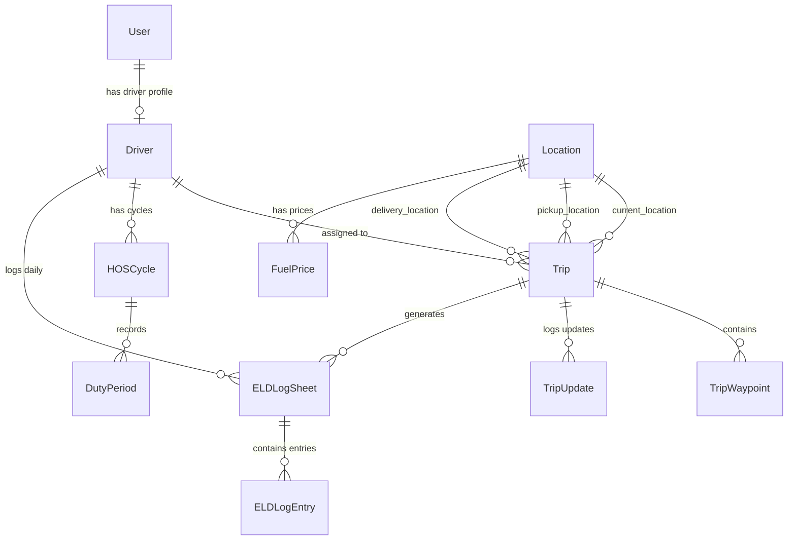

### **Core Database Schema Highlights**

#### `apps.drivers.models.Driver`
Extends `django.contrib.auth.models.User` with commercial trucking parameters:
- `license_number` (CDL ID), `dot_number` (USDOT Reg)
- `company_name`, `current_cycle_type` (`70_8` vs `60_7`)
- `home_terminal_address`, `home_terminal_timezone`

#### `apps.trips.models.Trip`
Represents scheduled and active logistics loads:
- `status`: `planned`, `in_progress`, `completed`, `cancelled`, `paused`
- `current_location`, `pickup_location`, `delivery_location` (FKs to `Location`)
- `total_distance_miles`, `estimated_driving_hours`, `estimated_total_hours`
- `load_weight`, `load_description`, `priority` (`low`, `medium`, `high`, `urgent`)
- `is_hos_compliant` (Boolean validated before trip dispatch)

#### `apps.locations.models.Location`
PostGIS-enabled spatial point entity:
- `coordinates`: `gis_models.PointField(srid=4326)`
- `location_type`: `warehouse`, `truck_stop`, `rest_area`, `terminal`
- `amenities`: JSON field storing available facilities (*parking, shower, fuel, wifi*)

#### `apps.hos.models.HOSCycle` & `DutyPeriod`
Tracks rolling cycle hours and duty status intervals:
- `duty_status`: `off_duty`, `sleeper_berth`, `driving`, `on_duty_not_driving`
- `total_hours_used`, `remaining_hours`, `consecutive_rest_hours`

#### `apps.eld.models.ELDLogSheet` & `ELDLogEntry`
Daily compliance logging sheet:
- `grid_start_position` (0–1440 min), `grid_end_position` (0–1440 min)
- `is_certified`, `certification_time`, `driver_signature`
- `odometer_start`, `odometer_end`, `total_miles`

---

## ⚡ API Architecture & Best Practices

### **RESTful API Structure**
The application exposes versioned REST APIs secured by JSON Web Tokens (JWT):

| Endpoint Path | HTTP Method | Description |
| :--- | :--- | :--- |
| `/api/core/token/` | `POST` | Obtain JWT access and refresh token pair |
| `/api/core/token/refresh/` | `POST` | Refresh expired JWT access token |
| `/api/drivers/me/` | `GET` / `PUT` | Manage logged-in driver profile & preferences |
| `/api/trips/` | `GET` / `POST` | List trips or create a new trip plan |
| `/api/trips/{id}/start_trip/` | `POST` | Transition trip to `in_progress` |
| `/api/trips/{id}/complete_trip/` | `POST` | Complete active trip |
| `/api/hos/live-status/` | `GET` | Get driver's real-time HOS duty status & remaining clocks |
| `/api/hos/update-status/` | `POST` | Execute live duty status transition |
| `/api/eld/logs/` | `GET` / `POST` | Fetch daily ELD log history or create manual entries |
| `/api/eld/logs/{id}/certify/` | `POST` | Sign and certify daily ELD log sheet |

---

## 🔄 End-to-End Operational Workflows

### 1. **Trip Planning & Dispatch Workflow**
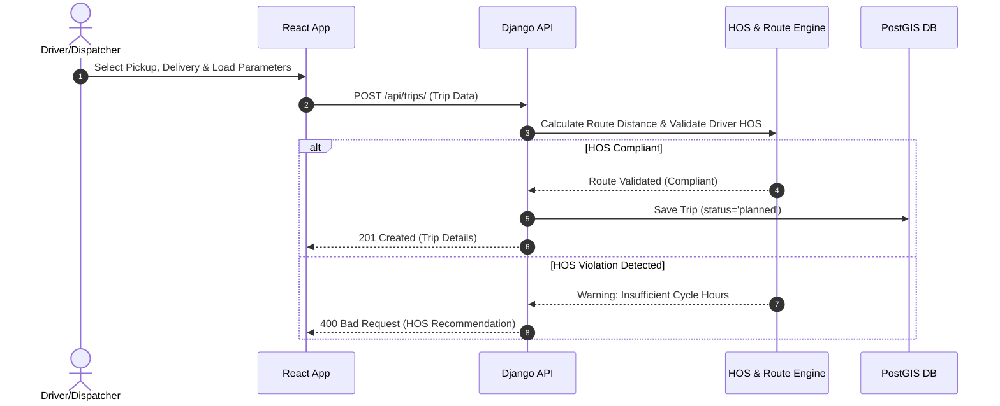

### 2. **Real-Time HOS Duty Status Update Workflow**
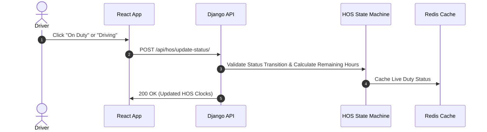

---

## 🚀 Key Engineering Best Practices Implemented

1. **Defensive Database Migrations & Prestart Verification**: Includes custom prestart Python scripts ([prestart.py](file:///d:/RIVON/truck-route-planner/prestart.py)) to verify database connectivity, health check PostgreSQL/Redis containers, and safely manage dynamic schema updates.
2. **Spatial Indexing & Query Optimization**: Utilizes PostGIS spatial indexing (`srid=4326`) for rapid location distance calculations and route lookup.
3. **Containerized Build Optimization**: Utilizes multi-stage Docker builds and `.dockerignore` filters to ensure small, secure image sizes and fast build times.
4. **Optimistic UI Updates with State Rollback**: React frontend implements optimistic UI updates when switching duty status, rolling back automatically if server verification fails.
5. **Decoupled Asynchronous Processing**: Offloads heavy tasks (periodic HOS status auto-switches, daily log generation, and weather alerts) to Celery workers backed by Redis.

---

## 💻 Local Quickstart & Running with Docker

### Prerequisites
- Docker Engine & Docker Compose installed.

### Execution Command
```bash
# Clone repository and navigate to root
cd /d/RIVON/truck-route-planner

# Start all backend containers (PostgreSQL, Redis, Prestart, Backend, Celery)
docker compose up -d --build

# Run frontend development server
cd frontend
npm install
npm run dev
```

### Access Points
- **Frontend Dashboard**: `http://localhost:3000`
- **Backend REST API**: `http://localhost:8000/api/`
- **Django Admin Portal**: `http://localhost:8000/admin/`

---

> **Developer**: TruckRoute Technical Architecture Team  
> **License**: Commercial / Portfolio Specification  
